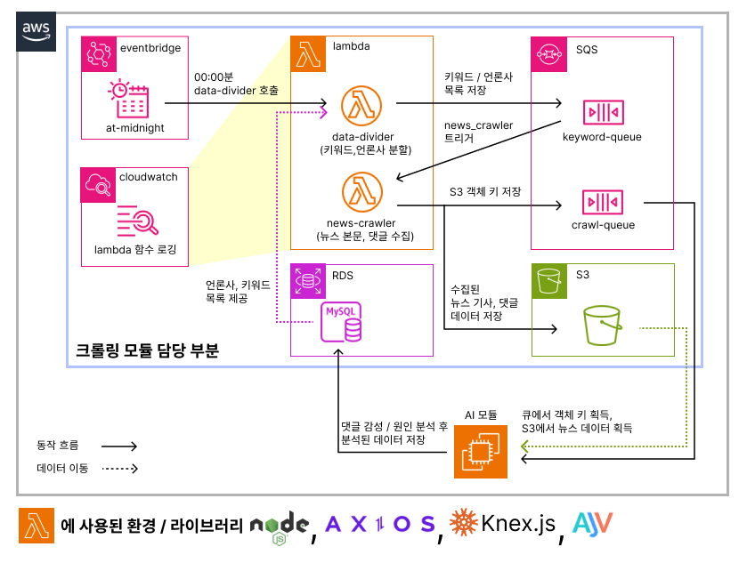
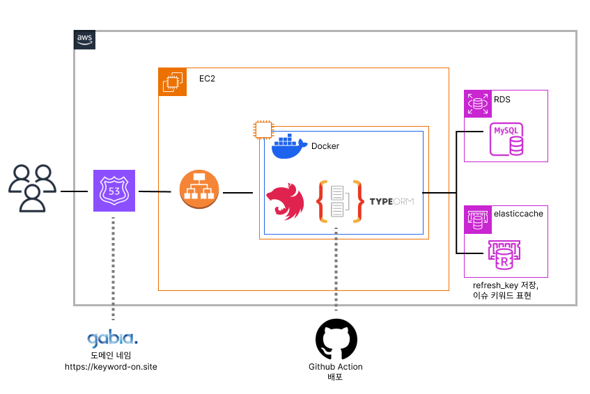
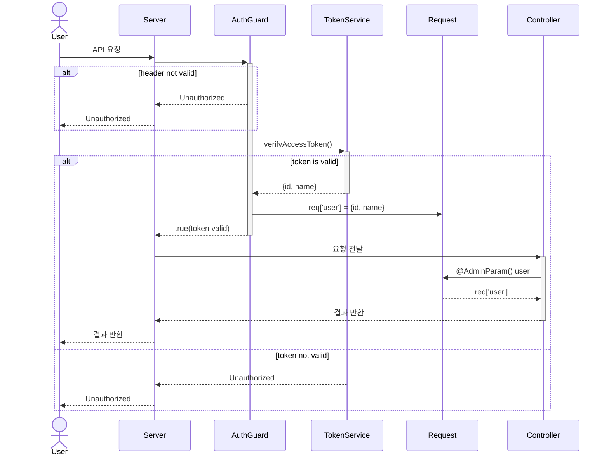
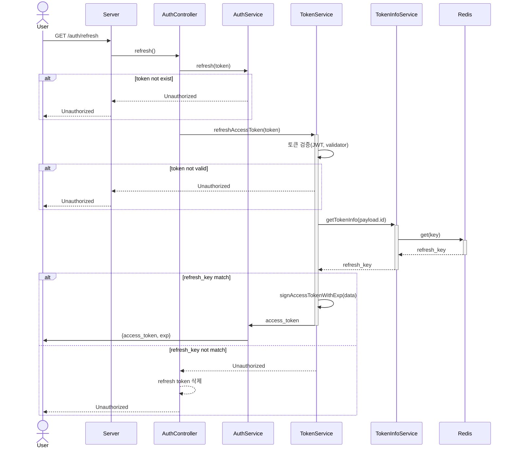
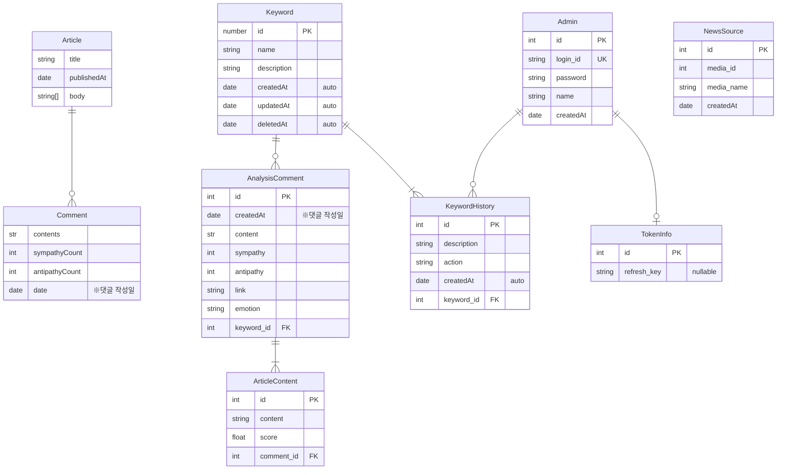

# 웹 API 백엔드 서버
- nest.js 기반으로 구성한 웹 API 백엔드 서버입니다.  
- 웹 API 백엔드 서버는 프로젝트 내 필요한 API 기능들을 제공합니다. 

## 구조도
### 스크래핑 모듈 구조도

[링크](https://github.com/blaxsior/lambda-deploy-test)
### 서버 구조도

## 사용법
API 서버는 docker 기반으로 동작하므로, 먼저 docker을 설치하세요.
- 실행: ``docker-compose -f docker-compose.dev.yml up``
- 중단: ``docker-compose -f docker-compose.dev.yml stop``

웹 API 백엔드 서버는 다음과 같은 목적을 위해 docker 기반으로 구성되어 있습니다.

### 관리 및 배포의 용이성  
  - docker 이미지를 기반으로 개발 환경에 구성한 서비스를 배포 환경에 동일하게 복제할 수 있습니다. 
  - 새로운 변경 사항이 발생할 때마다 일일이 서버 환경에 파일을 다운받고, 의존성을 설치하고, 의존성이 제대로 동작하는지 확인할 필요 없이 배포가 가능합니다.
### 환경 구성의 용이성
현재 API 서버에서는 다음과 같은 목적으로 redis을 이용합니다.
  1. jwt와 관련된 refresh_key를 저장
  2. 최근 이슈 키워드 기능을 구현

redis을 로컬에 설치하는 대신 docker 이미지 기반으로 사용하여 따로 redis을 설치할 필요 없이 docker-compose 명령만으로도 환경 구성을 수행할 수 있도록 했습니다.

# 구현한 기능
일부 기능은 관리자만 접근할 수 있도록 AuthGuard을 적용하여 인가 여부를 검사합니다. 관리자 접근 기능을 사용하고 싶다면 http 요청 시 헤더를 통해 유효한 access token을 ``Authentication: Bearer token`` 형식으로 전달합니다.

access token이 요구되는 기능은 ``Guard``에 @ 표시가 되어 있습니다.
## Auth
관리자 계정 및 인가 관련 기능을 수행합니다.
| 기능 | 설명 | 경로 | Guard |
|-|-|-| - |
|계정 생성|관리자 계정을 생성합니다. 관리자만 관리자 계정을 생성할 수 있습니다.|``POST /auth/signup``|@|
|로그인|관리자 계정에 로그인합니다. (id, password)가 필요합니다. 로그인에 성공할 때마다 ``refresh_key``를 갱신합니다.| ``POST /auth/signup``|
|로그아웃|http only cookie에 저장된 refresh token을 만료합니다. 프론트엔드는 access token을 제거해야 합니다. |``GET /auth/signout``|
|토큰 갱신|refresh token을 쿠키로 보내 access token을 갱신합니다.|``GET /auth/refresh``|
|인가|로그인 여부를 검사합니다. (``authentication: Bearer`` 기반)|[AuthGuard](./server/src/auth/auth.guard.ts) 적용|

### Auth 로직
로그인은 JWT 토큰을 이용하였습니다. JWT을 이용하면 사용자의 정보가 토큰 상에 저장되므로, 요청이 들어올 때마다 DB나 캐시를 조회하는 대신 토큰을 검증하여 사용자 정보를 얻을 수 있습니다. 사용자 정보가 서버 대신 클라이언트 측에 저장되어 확장성이 높다는 장점이 있습니다.

현재 인증 로직에는 2개의 토큰이 이용됩니다.

|토큰 종류|설명|저장소|
|-|-|-|
|access token| 사용자 유효성을 검증하는 토큰 |local storage 등|
|refresh token| access token을 갱신하는데 사용되는 토큰 |http-only cookie|

동작 방식은 다음과 같습니다.

1. 유저 로그인: access token은 만료 시간과 함께 json으로, refresh token은 쿠키로 전달한다.
2. 유저 요청: ``Authentication: Bearer ~``헤더에 유효한 토큰을 담아 사용자가 요청을 보낸다.
3. 토큰 검증: AuthGuard에서 토큰의 유효성을 검증한다. 
  - 토큰이 유효함: 사용자 정보를 request 객체에 저장하고, 요청을 수행한다.
  - 토큰이 유효하지 않음: 401 상태코드와 함께 요청을 거절한다.
4. 토큰 갱신: ``GET /auth/refresh`` 요청을 보내면 refresh token이 서버로 전달된다.  
refresh token의 유효성을 검증하고, 유저 정보를 access token으로 만든 후 반환한다.

refresh token의 페이로드 구조는 다음과 같습니다.

```typescript

export interface IOutAdminUser extends Pick<AdminUser, 'id' | 'name'> {
  id: number;
  name: string;
}

export interface RefreshTokenObj {
  data: IOutAdminUser;
  refresh_key: string;
}

```
- data: 유저의 정보를 의미합니다. access token 갱신 시 해당 정보가 access token에 반영됩니다.
- refresh_key: RefreshToken의 유효성을 한번 더 검증하는데 사용됩니다. 로그인에 성공할 때마다 갱신되며, 현재 refresh token이 유저의 최신 로그인에 의해 발행된 것인지 검증하는데 사용됩니다.

#### 검증 방식

refresh token을 검증하면 ``유저 id``와 ``refresh_key``를 얻을 수 있습니다.  

1. 로그인 시 ``유저 id`` : ``refresh_key``를  redis에 저장합니다. 
2. refresh_token이 유효할 때 redis와 토큰 상의 키의 동일성을 검사합니다.
3. 두 값이 동일하다면 현재 refresh token은 최신 로그인에 의해 발행되었으므로 유효합니다.
4. 두 값이 다르다면 현재 refresh token은 유효하지 않습니다. 토큰을 제거합니다.
#### 시퀀스 다이어그램
보안 관련된 로직을 이해할 수 있도록 작성한 시퀀스 다이어그램입니다. 실제 서버와 100% 대응되지는 않습니다.
- 인증

- 토큰 갱신



## Keyword
키워드는 뉴스 수집 대상으로, 관리자를 통해 추가하거나 갱신 가능합니다.
| 기능 | 설명 | 경로 | Guard |
|-|-|-|-|
|키워드 생성|관리자가 키워드를 생성합니다.|``POST /keywords``|@|
|키워드 갱신|관리자가 키워드를 갱신합니다. 키워드 사용 여부, 키워드에 대한 설명 등을 변경할 수 있습니다.| ``PUT /keywords``|@|
|키워드 목록 반환|등록된 키워드 목록을 반환합니다. 뉴스 스크래핑 모듈에서 수집 대상을 찾을 때 사용됩니다.|``GET /keywords``|

## NewsSource
NewsSource는 뉴스를 수집할 언론사를 의미합니다. 뉴스 스크래핑 모듈에서 주로 사용하게 됩니다.

| 기능 | 설명 | 경로 | Guard |
|-|-|-|-|
|언론사 추가|언론사를 추가합니다.|``POST /news-sources``|@|
|언론사 목록 반환|언론사 목록을 반환합니다.| ``GET /news_sources``||

## Search
- 사용자가 웹사이트를 통해 요청하는 데이터와 관련된 로직을 다룹니다. 
- 웹 사이트가 보여주는 키워드 / 댓글 관련 기능을 주로 처리합니다.

| 기능 | 설명 | 경로 | Guard |
|-|-|-|-|
|이슈 키워드 목록|최근 이슈 키워드 목록을 가져옵니다.|``GET /search/popular-keywords``||
|키워드 및 대표 댓글 목록|특정 키워드에 대해 기간 내 감정 별로 최대 공감 수를 받은 댓글들을 가져옵니다.| ``GET /search/keyword?keyword=~``||

# API 경로
현재 프로젝트는 [@nestjs/swagger](https://www.npmjs.com/package/@nestjs/swagger)을 이용하여 API를 문서화합니다. 서버를 가동한 후 다음 주소를 통해 swagger 문서를 볼 수 있습니다.
- http://localhost:8080/api 
- http://localhost:8080/api-json

# ERD
현재 프로젝트에서 사용되는 ER 구조를 명시합니다.

1. 저장되지 않는 엔티티
    - Article: 크롤링 한 기사 내용
    - Comment: 크롤링 한 댓글 목록
2. 저장되는 엔티티
    - AnalysisComment: 분석된 댓글. 세부 감정 / URL 포함
    - ArticleContent: 분석된 댓글과 연관성 높은 기사 내 문장
    - Keyword: 수집 대상이 되는 키워드
    - KeywordHistory: 키워드 생성 / 수정 내역
3. redis에서 관리되는 엔티티
    - TokenInfo: refresh_key만 임시로 저장

## 저장되지 않는 엔티티
Article 및 Comment는 데이터 수집 기능에 의해 수집된 후 임시적으로 AWS S3 버킷에 JSON 형식으로 저장됩니다. DB 상에는 저장되지 않으며, AI 서버에 의해 소비된 후 바로 제거하도록 설계하였습니다. 윤리적 / 저작권적 이유를 고려했습니다.

크롤링 데이터의 포맷은 다음과 같습니다.
```typescript
interface Article {
  title: string; // 기사 제목
  publishedAt: string; // date-string
  body: string[]; // 기사 본문
}

interface Comment {
  contents: string; // 댓글
  sympathyCount: number; // 공감수
  antipathyCount: number; // 비공감수
  date: string; // date-string
}

interface CrawlingDataType {
  keyword: string; // 관련 키워드
  data: {
    url: string; // 뉴스 url
    news: Article;
    comments: Comment[];
  }[];
}
```
## 저장되는 엔티티
TokenInfo를 제외한 엔티티들은 RDS-mysql에 저장됩니다. 각 서버가 처리하는 데이터는 다음과 같습니다.
- AI 서버: ``AnalysisComment``, ``ArticleContent``
- API 서버: ``Keyword``, ``KeywordHistory``, ``Admin``, ``NewsSource``, ``TokenInfo``

분석된 결과는 AI 서버에서 RDS로 저장됩니다. API 서버는 관리자 관련 기능을 수행합니다.

### TokenInfo에 Redis을 이용하는 이유
TokenInfo의 경우 초기에는 RDS-mysql 환경에 저장하도록 구현하였으나, 이후 redis에 저장하도록 구현을 변경하였습니다. 고려한 점은 다음과 같습니다.

1. refresh token의 유효성을 판단하는데 사용되는 tokeninfo의 refresh_key는 로그인을 수행할 때마다 갱신되는 랜덤한 문자열입니다. 사용자에 의해 자주 갱신될 수 있지만, 분실하더라도 큰 문제가 발생하지 않으므로, in-memory db인 redis를 이용하여 빠른 엑세스 속도를 보장받는 것이 더 좋다고 판단했습니다.
2. redis는 EXPIRE 명령 등을 통해 데이터에 대한 만료 기간을 지정할 수 있습니다. refresh_key는 주어진 시간이 지나면 만료되어야 하는데, redis을 이용하면 쉽게 만료 기능을 구현할 수 있습니다.

## 엔티티 설명
- AI 서버
  - AnalysisComment: 분석된 댓글 정보
  - ArticleContent: 분석된 댓글과 관계가 있는 문장
- API 서버
  - Keyword: 데이터 수집 대상이 되는 키워드
  - KeywordHistory: 키워드에 대해 관리자가 수행한 동작 기록
  - Admin: 관리자 유저
  - TokenInfo: 관리자가 로그인 시 필요한 토큰 정보(refresh_key)
  - NewsSource: 뉴스를 읽어 오는 언론사. 상세 검색 페이지에서 ID 추출 필요