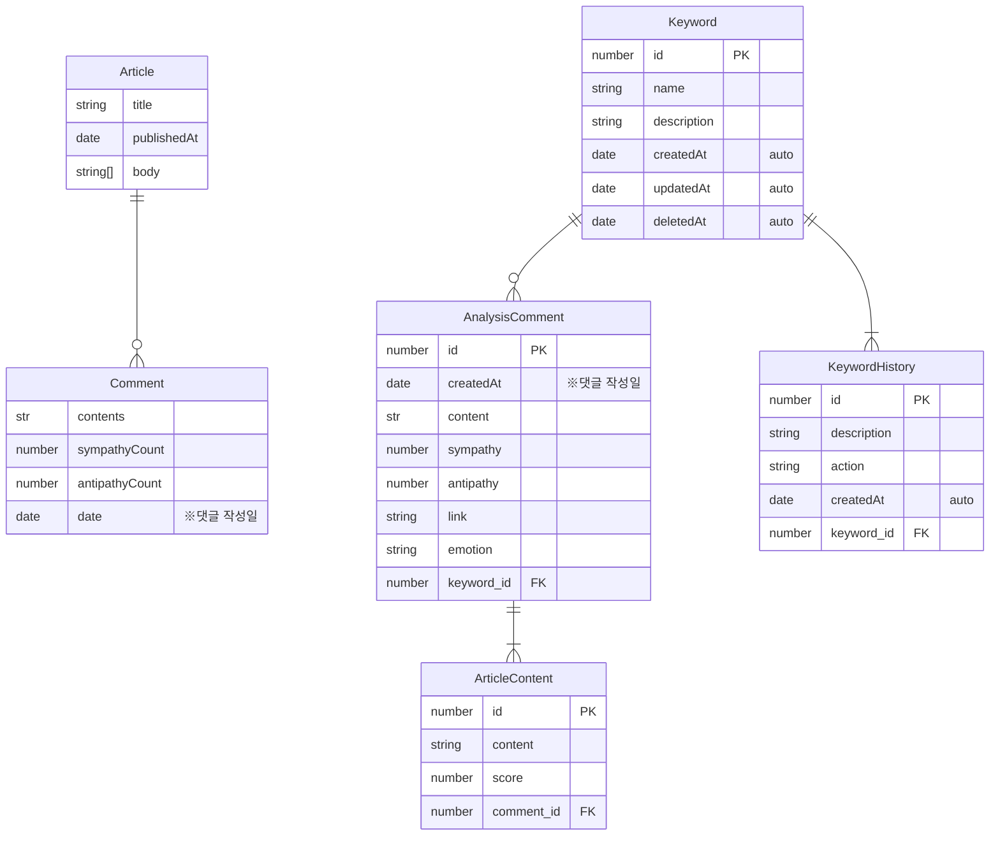

# ERD
현재 프로젝트에서 사용되는 ER 구조를 명시합니다.

1. 저장되지 않는 엔티티
    - Article: 크롤링 한 기사 내용
    - Comment: 크롤링 한 댓글 목록
2. 저장되는 엔티티
    - AnalysisComment: 분석된 댓글. 세부 감정 / URL 포함
    - ArticleContent: 분석된 댓글과 연관성 높은 기사 내 문장
    - Keyword: 수집 대상이 되는 키워드
    - KeywordHistory: 키워드 생성 / 수정 내역

## 저장되지 않는 엔티티
Article 및 Comment는 데이터 수집 기능에 의해 수집된 후 임시적으로 AWS S3 버킷에 JSON 형식으로 저장됩니다. DB 상에는 저장되지 않으며, AI 서버에 의해 소비된 후 바로 제거하도록 설계하였습니다.

크롤링 데이터의 포맷은 다음과 같습니다.
```typescript
interface Article {
  title: string; // 기사 제목
  publishedAt: string; // date-string
  body: string[]; // 기사 본문
}

interface Comment {
  contents: string; // 댓글
  sympathyCount: number; // 공감수
  antipathyCount: number; // 비공감수
  date: string; // date-string
}

interface CrawlingDataType {
  keyword: string; // 관련 키워드
  data: {
    url: string; // 뉴스 url
    news: Article;
    comments: Comment[];
  }[];
}
```
## 저장되는 엔티티
저장되는 엔티티들은 RDS-mysql에 저장됩니다. 각 서버가 처리하는 데이터는 다음과 같습니다.
- AI 서버: AnalysisComment, ArticleContent
- API 서버: Keyword, KeywordHistory

분석된 결과는 AI 서버에서 바로 저장됩니다. API 서버는 키워드 및 데이터를 관리합니다.