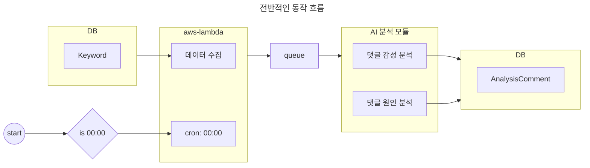

```mermaid
---
title: 전반적인 동작 흐름
---
flowchart LR
    subgraph db1 [DB]
      Keyword
    end
    db1 --> a2

    s((start)) --> condition{is 00:00}
    condition --> a1
    subgraph A [aws-lambda]
        a1[cron: 00:00]
        a2[데이터 수집]
    end
    A --> Q
    Q[queue]
    Q --> B
    subgraph B [AI 분석 모듈]
        direction LR
        b1[댓글 감성 분석]
        b2[댓글 원인 분석]
    end

    b1 --> db2
    b2 --> db2

    subgraph db2 [DB]
        direction TB
        AnalysisComment
    end
```