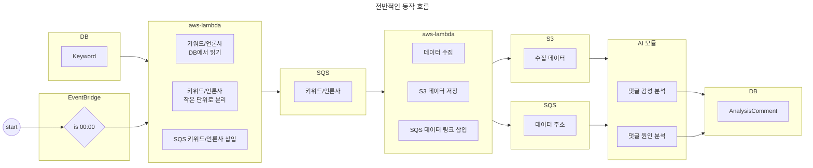

전체적인 동작 구상은 다음과 같다.
1. EventBridge 스케줄링 서비스를 이용하여 UTC +9 기준 첫번째 람다 함수 실행
    - 첫번째 람다 함수는 데이터 처리 규모를 15분 이내로 쪼갠다. (람다 최대 실행 시간 15분 제한 존재)
    - 키워드 / 언론사 정보를 적절하게 쪼개서 SQS 큐에 삽입
2. 두번째 람다 함수는 SQS에서 키워드 및 언론사 관련 정보를 읽어들인 후 해당 데이터  기반으로 뉴스 기사 / 댓글 정보 수집
    - SQS는 한번에 256kb까지의 데이터만 한번에 보낼 수 있으나, 수집한 데이터의 크기는 256kb를 초과하는 경우가 많았음.
    - 읽은 데이터를 S3에 임시로 저장, 해당 파일의 주소를 SQS 상에 담아 전송
3. AI 모듈이 동작함.
    - 특정 키워드에 대한 뉴스/댓글을 크롤링 하여 S3에 저장
    - SQS에서 파일 url 정보를 읽어옴(읽은 후, 읽은 데이터 SQS에서 제거) 
    - 파일의 url을 기반으로 S3 버킷에서 데이터를 읽어옴
    - S3에서 읽은 파일 제거
    - 읽은 내용 기반으로 감성 / 원인 분석 후 DB에 저장
