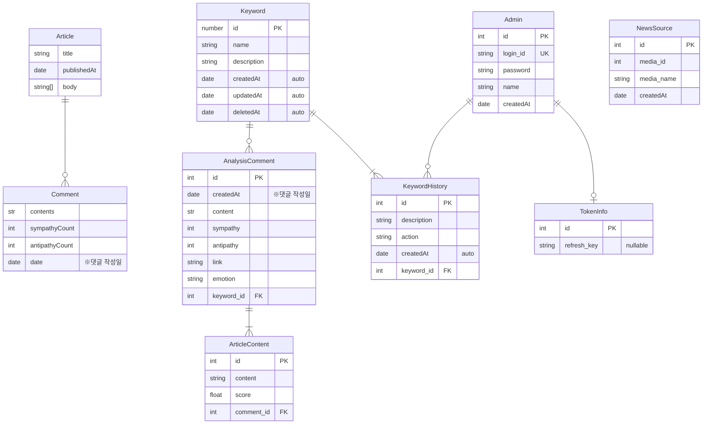

## ERD
현재 프로젝트에서 사용되는 ER 구조를 명시합니다.

1. 저장되지 않는 엔티티
    - Article: 크롤링 한 기사 내용
    - Comment: 크롤링 한 댓글 목록
2. 저장되는 엔티티
    - AnalysisComment: 분석된 댓글. 세부 감정 / URL 포함
    - ArticleContent: 분석된 댓글과 연관성 높은 기사 내 문장
    - Keyword: 수집 대상이 되는 키워드
    - KeywordHistory: 키워드 생성 / 수정 내역
3. redis에서 관리되는 엔티티
    - TokenInfo: refresh_key만 임시로 저장

### 저장되지 않는 엔티티
Article 및 Comment는 데이터 수집 기능에 의해 수집된 후 임시적으로 AWS S3 버킷에 JSON 형식으로 저장됩니다. DB 상에는 저장되지 않으며, AI 서버에 의해 소비된 후 바로 제거하도록 설계하였습니다. 윤리적 / 저작권적 이유를 고려했습니다.

크롤링 데이터의 포맷은 다음과 같습니다.
```typescript
interface Article {
  title: string; // 기사 제목
  publishedAt: string; // date-string
  body: string[]; // 기사 본문
}

interface Comment {
  contents: string; // 댓글
  sympathyCount: number; // 공감수
  antipathyCount: number; // 비공감수
  date: string; // date-string
}

interface CrawlingDataType {
  keyword: string; // 관련 키워드
  data: {
    url: string; // 뉴스 url
    news: Article;
    comments: Comment[];
  }[];
}
```
### 저장되는 엔티티
TokenInfo를 제외한 엔티티들은 RDS-mysql에 저장됩니다. 각 서버가 처리하는 데이터는 다음과 같습니다.
- AI 서버: ``AnalysisComment``, ``ArticleContent``
- API 서버: ``Keyword``, ``KeywordHistory``, ``Admin``, ``NewsSource``

분석된 결과는 AI 서버에서 RDS로 저장됩니다. API 서버는 관리자 관련 기능을 수행합니다.

#### TokenInfo에 Redis을 이용하는 이유
TokenInfo의 경우 초기에는 RDS-mysql 환경에 저장하도록 구현하였으나, 이후 redis에 저장하도록 구현을 변경하였습니다. 고려한 점은 다음과 같습니다.

1. refresh token의 유효성을 판단하는데 사용되는 tokeninfo의 refresh_key는 로그인을 수행할 때마다 갱신되는 랜덤한 문자열입니다. 사용자에 의해 자주 갱신될 수 있지만, 분실하더라도 큰 문제가 발생하지 않으므로, in-memory db인 redis를 이용하여 빠른 엑세스 속도를 보장받는 것이 더 좋다고 판단했습니다.
2. redis는 EXPIRE 명령 등을 통해 데이터에 대한 만료 기간을 지정할 수 있습니다. refresh_key는 주어진 시간이 지나면 만료되어야 하는데, redis을 이용하면 쉽게 만료 기능을 구현할 수 있습니다.

### 엔티티 설명
- AI 서버
  - AnalysisComment: 분석된 댓글 정보
  - ArticleContent: 분석된 댓글과 관계가 있는 문장
- API 서버
  - Keyword: 데이터 수집 대상이 되는 키워드
  - KeywordHistory: 키워드에 대해 관리자가 수행한 동작 기록
  - Admin: 관리자 유저
  - TokenInfo: 관리자가 로그인 시 필요한 토큰 정보(refresh_key)
  - NewsSource: 뉴스를 읽어 오는 언론사. 상세 검색 페이지에서 ID 추출 필요